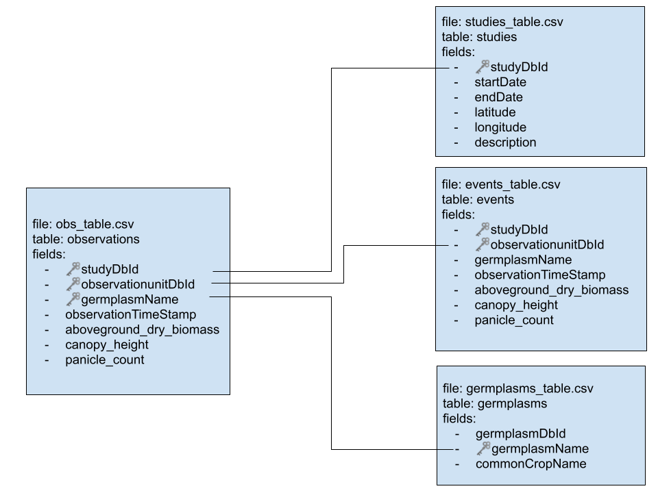

# ARDN Project Code: annotate and convert TERRA REF data into Crop Model Inputs

Learn more about ARDN https://agmip.github.io/ARDN/

## Pipeline

### Diagram mapping pipeline steps


### Steps and Repository Contents

| **Step**                        | **Input data**                                                                                        | **Input data location**                    | **Output data**                                                                                     | **Output data location**                                 | **Processing tool**                                                                                               |
|---------------------------------|-------------------------------------------------------------------------------------------------------|--------------------------------------------|-----------------------------------------------------------------------------------------------------|----------------------------------------------------------|-------------------------------------------------------------------------------------------------------------------|
| 1. Reformatting raw data        | [TERRA REF BrAPI JSONs](https://github.com/cct-datascience/ardn-terra-ref/tree/master/json_data/data) | `json_data` folder                         | [TERRA REF BrAPI csvs](https://github.com/cct-datascience/ardn-terra-ref/tree/master/csv_data/data) | `csv_data` folder                                        | [R script](https://github.com/cct-datascience/ardn-terra-ref/blob/master/csv_data/scripts/download_and_convert.R) |
| 2. Mapping ICASA variables      | [TERRA REF BrAPI csvs](https://github.com/cct-datascience/ardn-terra-ref/tree/master/csv_data/data)   | `csv_data` folder                          | SC2                                                                                                 | `sidecar` folder                                         | VMapper                                                                                                           |
| 3. Getting ICASA-compliant data | TERRA REF BrAPI csvs + SC2                                                                            | `csv_data` folder + `sidecar` folder       | AgMIP csv                                                                                           | `agmip` folder                                           | VMapper (AgMIP input package button)                                                                              |
| 4. Generating model input files | AgMIP csv + DOME + linkage                                                                            | `agmip` folder + `dssat/add_inputs` folder | DSSAT files + ACEB .aceb                                                                            | `quadUIoutput/DSSAT` folder + `quadUIoutput/ACEB` folder | QuadUI                                                                                                            |
| 5. Running model                | DSSAT input file                                                                                      | `quadUIoutput/DSSAT` folder                | DSSAT output files                                                                                  | `dssat/results` folder                                   | Compiled DSSAT                                                                                                    |


* `raw_brapi_data/`: directly from terraref endpoints.
  * except /events which were hand crafted. 
* `azmet`: contains daily weather data
* `dssat` inputs to QuadUI for dssat runs (could be renamed 'QuadUI_inputs/dssat/`?)
* `quadUIoutput/DSSAT`: output from QuadUI for DSSAT
* `json_data/` contains code slightly modified using scripts in `json_data/scripts`
  * currently unused, pending QuadUI support for JSON

#### List of TERRA REF BrAPI csvs & linking keys

1. obs_table
2. studies_table
3. germplasms_table
4. events_table

- obs_table <-> studies_table: studyDbId
- obs_table <-> events_table: observationunitDbId/observationUnitDbIds
- obs_table <-> germplasms_table: germplasmName



#### To run code in R console

If developing the API on your computer, make sure to set the base_url. By 
default it will point to [terraref.org](https://terraref.org)

```R
#Sys.setenv(BASEURL='https://terraref.org')
Sys.setenv(BASEURL='http://localhost:5000')
source('download_studies.R')
source('download_germplasm.R')
source('download_observations.R')
```

### Convert to ACE-B

#### Web Interface 

Easiest to use, but less stable

https://data.agmip.org/ardn/tools/data_factory
#### Install QuadUI

~~Download QuadUI from https://github.com/agmip/quadui/releases~~

Download most recent version of QuadUI from https://github.com/MengZhang/quadui/releases

#### Run QuadUI

```psl
set PATH=C:\Program Files (x86)\Java\jre1.8.0_301\bin;%PATH%
cd C:\Users\David\Downloads\QuadUI_v1.3.9-beta22
.\QUADUI.BAT
```

- 

##### QuadUI command line


```psl

# to get help
java -help quadui-1.3.9-beta22.jar

java quadui-1.3.9-beta22.jar  -cli -help

java -jar quadui-1.3.9-beta22.jar  -cli -DJ -f dome_filename.csv
```

#### Load files


## TODO

* API
    * [ ] finish events.json
    * [ ] review schema and terms _w/ ICASA folk_
    * update BrAPI events.py to use above
* Running DSSAT 
    * configure DOME file for s4 and s6
    * see if we have irrigation rates somewhere (like from the PEG project)
    * update mappings
        * study --> EXNAME
        * treatment --> TRT_NAME
        * planting date --> PDATE
        * yield --> CWAH
        * harvest date --> HADAT
    * generate DSSAT inputs
    * cultivars: convert date to GDD to phenology phase
    * weather file
    * soil file
