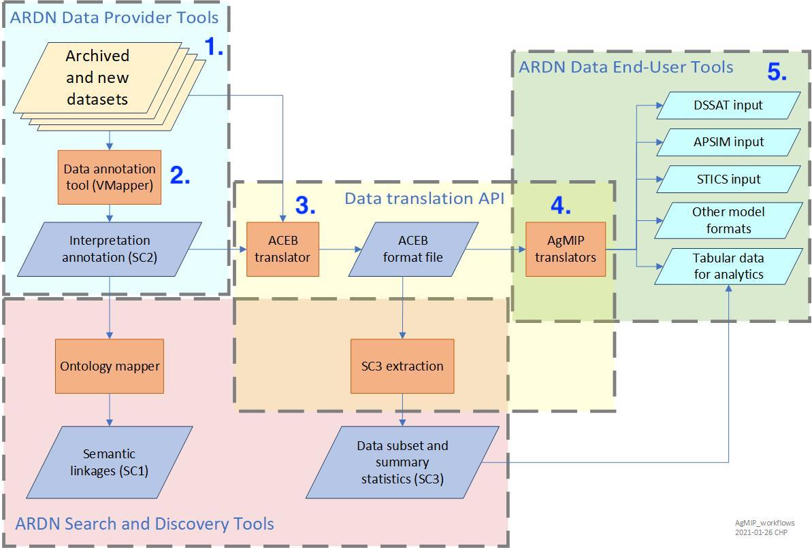

## Harmonizing and modeling BrAPI TERRA REF data

This repository contains code, data, and intermediate files for harmonizing data from the TERRA-REF BrAPI endpoint into the ARDN format and running it through the DSSAT model. The data transformation pipeline is outlined below. 

Learn more about this project at the ARDN website here: https://agmip.github.io/ARDN/

### Pipeline

| **Step**                        | **Input data**                                    | **Output data**                                                                                                                                                                                                 | **Output data location**                    | **Processing tool**                                                                                                                                                                                         |
|---------------------------------|---------------------------------------------------|-----------------------------------------------------------------------------------------------------------------------------------------------------------------------------------------------------------------|---------------------------------------------|-------------------------------------------------------------------------------------------------------------------------------------------------------------------------------------------------------------|
| 1. Reformatting raw data        | TERRA REF JSONs from BrAPI                        | [TERRA REF BrAPI csvs](https://github.com/cct-datascience/ardn-terra-ref/tree/master/csv_data/data)                                                                                                             | `csv_data` folder                           | [R script](https://github.com/cct-datascience/ardn-terra-ref/blob/master/csv_data/scripts/download_and_convert.R)                                                                                           |
| 2. Mapping ICASA variables      | TERRA REF BrAPI csvs                              | [SC2](https://github.com/cct-datascience/ardn-terra-ref/tree/master/dssat_files/sc2.json)                                                                                                                       | `dssat_files` folder                        | [VMapper](https://vmapper.herokuapp.com/tools/vmapper#)                                                                                                                                                     |
| 3. Getting ICASA-compliant data | TERRA REF BrAPI csvs + SC2                        | [AgMIP zip](https://github.com/cct-datascience/ardn-terra-ref/tree/master/dssat_files/AgMIP_Input.zip)                                                                                                          | `dssat_files` folder                        | VMapper (AgMIP input package button)                                                                                                                                                                        |
| 4. Get model-specific files     |                                                   | [DOME + linkage files](https://github.com/cct-datascience/ardn-terra-ref/tree/master/dssat_files/DOME)                                                                                                          | `dssat_files/DOME`  folder                  | Hand-written based on [DOME template](https://github.com/agmip/json-translation-samples/blob/master/Maize_Machakos/raw/Field_Overlay-Machakos-MAZ.xlsx) & [linkage info](https://agmip.github.io/DOME.html) |
| 5. Generating model input files | AgMIP zip + DOME + linkage                        | [DSSAT files](https://github.com/cct-datascience/ardn-terra-ref/tree/master/dssat_files/dssat_input) + [ACEB .aceb](https://github.com/cct-datascience/ardn-terra-ref/tree/master/dssat_files/AgMIP_Input.aceb) | `dssat_files/dssat_input` and `dssat_files` | [Data Factory](http://vmapper-test.herokuapp.com/tools/data_factory#)                                                                                                                                       |
| 6. Running model                | DSSAT input files + cultivar, weather, soil files | DSSAT output files                                                                                                                                                                                              | `dssat_files/dssat_input` folder            | Compiled DSSAT                                                                                                                                                                                              |

#### Diagram mapping pipeline steps

### Repository file structure

- `csv_data/`
  - `scripts/download_and_convert.R`: script downloads raw BrAPI TERRA REF JSON data from 4 endpoints (observationunits, studies, germplasm, and events) and converts to required CSV format
  - `data/`: contains converted csv data files
    - `studies_table.csv`
    - `obs_table.csv`
    - `germplasms_table.csv`
    - `events_table.csv.gz`
  - `mvp/`: (obsolete) contains older versions of converted BrAPI TERRA REF JSON files
- `dssat_files/`
  - `sc2.json`: sidecar file that maps csv files with [AgMIP ICASA variables](https://docs.google.com/spreadsheets/u/0/d/1MYx1ukUsCAM1pcixbVQSu49NU-LfXg-Dtt-ncLBzGAM/pub?output=html)
  - `AgMIP_Input.zip`: resulting csv file from apply sidecar to data csv files
  - `DOME/`
    - `Field_Overlay_s4.csv`: DSSAT-specific DOME file that contributes additional required inputs to run model
    - `LINKAGE_s4_v2.csv`: DDSAT-specific linkage file that enables individual DOME files to be used for multiple experiments or seasons
  - `AgMIP_Input.aceb`: ACEB-format file
  - `dssat_input.zip`
  - `dssat_input/`: generated from above zip file; contains DSSAT-specific input files and model run output files; many files, only including ones that are used
    - `DSSBatch.v48`
    - `TERRAR01.SGX`
    - `Summary.OUT`
- `azmet/`: contains daily weather data (not used in DSSAT run yet)
- `irrigation/`: contains irrigation rates for Season 4 during the drought experiment
  - `season_4_irrigation.csv`
    - `day`: date in YYYY-MM-DD format
    - `early_drought`: mm of water applied to plots in early drought treatment
    - `late_drought`: mm of water applied to plots in late drought treatment
    - note that these irrigation rates only differ for the Aug 1-14 (early drought) and Aug 15-31 (late drought) treatments
  - `season_4_irrigation.csv`: raw data including gallons water per day and total area irrigated; to show calculations. Date and last two columns are identical to the three columns in the `season_4_irrigation_raw.csv` file  
- `raw_brapi_json/`: (obsolete) contains R script for converting raw TERRA REF JSON files into format needed by collaborator, and resulting .json files
- `json_data/scripts`: (obsolete) contains R scripts for converting raw TERRA REF JSON files into format needed by collaborator

### Overview of relationships among tables provided as CSV files

Four tables were generated from the `download_and_convert.R` script that turned BrAPI JSON into tables provided as CSV. These tables and their relational keys are shown in the image below. 

### Generating DSSAT input files

The files in the previous section are used with the sidecar 2 file to generate input files for crop models with the AgMIP 'Data Factory' web interface, found at [this website](https://data.agmip.org/ardn/tools/data_factory). This program is used to get inputs to multiple different models, including DSSAT (used here), APSIM, and STICS. 

### DSSAT input and output files

All DSSAT input files, which are generated by the Data Factory, are available in `dssat_input.zip` in `dssat_files` folder. These files are also in `dssat_input` subfolder, along with DSSAT output files. Lists of these files are below. 

**DSSAT input files**

- `ACMO_meta.dat`
- `DSSBatch.v47`
- `DSSBatch.v48`
- `Run47.bat`
- `Run48.bat`
- `TERRAR01.SGA`
- `TERRAR01.SGT`
- `TERRAR01.SGX`

**DSSAT output files**

- `DSSAT48.INH`
- `DSSAT48.INP`
- `Evaluate.OUT`
- `OVERVIEW.OUT`
- `PlantGro.OUT`
- `SoilCBal.OUT`
- `SoilCBalSum.OUT`
- `SoilOrg.OUT`
- `Summary.OUT`
- `WARNING.OUT`
- `Weather.OUT`

Some of the DSSAT output files in this repo are specific to one author's model run and are provided as an example. If you want to run DSSAT with TERRA REF data, you should regenerate all DSSAT input and output files yourself, starting with deleting `dssat_input.zip` and `dssat_input` from your local copy of this repo. 

### How to run DSSAT

- Compile model locally (optional for Windows, required for Linux systems)
  - These instructions assume model version is 4.8, so file names contain 48
  - Clone source code from [dssat-csm-os](https://github.com/DSSAT/dssat-csm-os) repo
  - Run make commands
  - `dscsm048` is executable model file
- Move additional data files into correct location
  - Need DSSAT-specific files for cultivar (Sorghum), Arizona weather, and Arizona soils
  - Copy `Data/` subfolder from `dssat-csm-os` repo, which has `Genotype/`, `Soil/` and `Weather/` subfolders
  - Paste into path specified in `DSSATPRO.L48`; alternatively move relevant data files into main compiled model folder or change file paths in `DSSATPRO.L48`
  - Data file suffix number should match model batch file suffix number, e.g., 48
- Run model
  - From DSSAT input files, generated in step 5 in pipeline, run `/path/to/dscsm048 b DSSBatch.v48`
  - If successful, there will be no errors and a summary of all simulations can be viewed in `Summary.OUT`

### References

LeBauer, David et al. (2020), Data From: TERRA-REF, An open reference data set from high resolution genomics, phenomics, and imaging sensors, Dryad, Dataset, https://doi.org/10.5061/dryad.4b8gtht99

Hoogenboom, G., C.H. Porter, K.J. Boote, V. Shelia, P.W. Wilkens, U. Singh, J.W. White, S. Asseng, J.I. Lizaso, L.P. Moreno, W. Pavan, R. Ogoshi, L.A. Hunt, G.Y. Tsuji, and J.W. Jones. 2019. The DSSAT crop modeling ecosystem. In: p.173-216 [K.J. Boote, editor] Advances in Crop Modeling for a Sustainable Agriculture. Burleigh Dodds Science Publishing, Cambridge, United Kingdom, http://dx.doi.org/10.19103/AS.2019.0061.10
