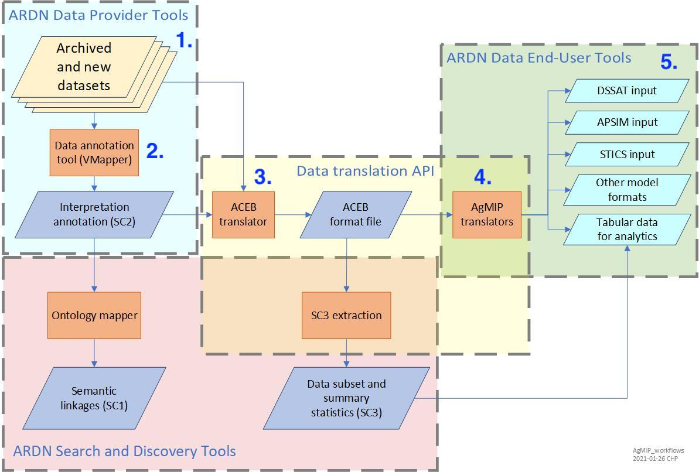

### Pipeline

| **Step**                        | **Input data**                                                                                        | **Input data location**                    | **Output data**                                                                                     | **Output data location**                                 | **Processing tool**                                                                                               |
|---------------------------------|-------------------------------------------------------------------------------------------------------|--------------------------------------------|-----------------------------------------------------------------------------------------------------|----------------------------------------------------------|-------------------------------------------------------------------------------------------------------------------|
| 1. Reformatting raw data        | [TERRA REF BrAPI JSONs](https://github.com/cct-datascience/ardn-terra-ref/tree/master/json_data/data) | `json_data` folder                         | [TERRA REF BrAPI csvs](https://github.com/cct-datascience/ardn-terra-ref/tree/master/csv_data/data) | `csv_data` folder                                        | [R script](https://github.com/cct-datascience/ardn-terra-ref/blob/master/csv_data/scripts/download_and_convert.R) |
| 2. Mapping ICASA variables      | [TERRA REF BrAPI csvs](https://github.com/cct-datascience/ardn-terra-ref/tree/master/csv_data/data)   | `csv_data` folder                          | SC2                                                                                                 | `sidecar` folder                                         | VMapper                                                                                                           |
| 3. Getting ICASA-compliant data | TERRA REF BrAPI csvs + SC2                                                                            | `csv_data` folder + `sidecar` folder       | AgMIP csv                                                                                           | `agmip` folder                                           | VMapper (AgMIP input package button)                                                                              |
| 4. Generating model input files | AgMIP csv + DOME + linkage                                                                            | `agmip` folder + `dssat/add_inputs` folder | DSSAT files + ACEB .aceb                                                                            | `quadUIoutput/DSSAT` folder + `quadUIoutput/ACEB` folder | QuadUI                                                                                                            |
| 5. Running model                | DSSAT input file                                                                                      | `quadUIoutput/DSSAT` folder                | DSSAT output files                                                                                  | `dssat/results` folder                                   | Compiled DSSAT                                                                                                    |

#### Diagram mapping pipeline steps

### List of TERRA REF BrAPI csvs & linking keys

1. obs_table
2. studies_table
3. germplasms_table
4. events_table

- obs_table <-> studies_table: studyDbId
- obs_table <-> events_table: observationunitDbId/observationUnitDbIds
- obs_table <-> germplasms_table: germplasmName
